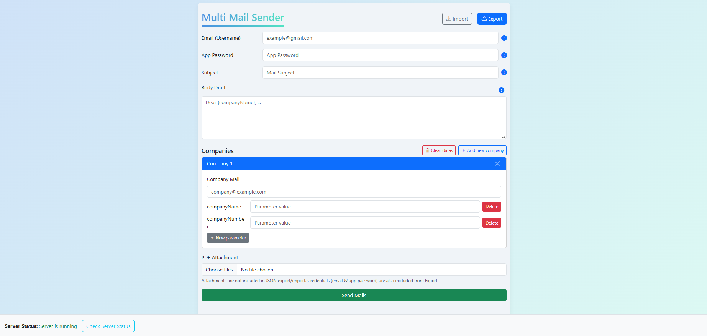

# MultiMailSender

MultiMailSender is an open-source bulk email sending application with a modern Angular-based frontend and a robust Spring Boot backend. It allows you to send personalized emails to multiple recipients, each with custom parameters and optional attachments.

## Features

- Bulk email sending with per-recipient personalization
- Supports PDF and other file attachments
- Secure authentication using Gmail App Password
- User-friendly, modern, and well-documented interface
- Server health check endpoint
- Easy deployment with Docker support

## Technologies Used

- **Backend:** Java 17, Spring Boot 3, Spring Mail, Maven, Lombok
# MultiMailSender

MultiMailSender, Angular tabanlı modern bir ön yüz ve Spring Boot tabanlı sağlam bir arka yüz ile çoklu kişilere kişiselleştirilmiş e-posta göndermenizi sağlayan bir açık kaynak uygulamadır. Her alıcı için farklı parametreler kullanabilir, ek dosyalar (PDF vb.) gönderebilir ve gönderim ilerlemesini gerçek zamanlı olarak takip edebilirsiniz.



## Özellikler

- Kitle (bulk) e-posta gönderimi
- Her alıcıya özel kişiselleştirilmiş şablon alanları (ör. {companyName})
- Dosya ekleri desteği (PDF, dokümanlar)
- Gmail App Password ile güvenli SMTP gönderimi
- Gönderim ilerleme bildirimleri ve durum takibi
- Docker ile kolay dağıtım opsiyonu

## Teknolojiler

- Backend: Java 17, Spring Boot, Spring Mail, Maven
- Frontend: Angular, Bootstrap, RxJS
- Diğer: Docker (opsiyonel)

## Hızlı Başlangıç (Windows)

Öncelikle repoyu klonlayın ve proje dizinine gidin:

1) Backend (Spring Boot)

- Gereksinimler: Java 17+ ve Maven
- Proje dizinine gidin ve çalıştırın:

```powershell
cd backend\MultiMailSender
.\mvnw clean install
.\mvnw spring-boot:run
```

Alternatif olarak sisteminizde Maven varsa:

```powershell
mvn clean install
mvn spring-boot:run
```

2) Frontend (Angular)

- Gereksinimler: Node.js (18+), npm
- Frontend dizinine gidin ve bağımlılıkları kurup çalıştırın:

```powershell
cd frontend\multi-mail-sender
npm install
npm start
```

Ardından tarayıcıda `http://localhost:4200` adresini açın.

## API Kullanımı

### Toplu Mail Gönderimi

- Endpoint: `POST /send-mails-with-attachment`
- Content-Type: `multipart/form-data`
- Parametreler:
  - `request` : (JSON) Gönderici bilgileri, konu, gövde ve alıcı listesi
  - `files` : (opsiyonel) Ek dosyalar

Örnek `request` JSON (bkz. `backend/MultiMailSender/src/main/resources/exampleRequest.json`):

```json
{
  "username": "example@gmail.com",
  "password": "examplePassword",
  "subject": "Konu örneği",
  "bodydraft": "Merhaba {companyName}, ...",
  "companyData": [
    { "id": 0, "companyMail": "company0@gmail.com", "parameters": { "companyName": "company0" } }
  ]
}
```

### Sağlık Kontrolü (Health)

- Endpoint: `GET /health`
- Örnek cevap:

```json
{
  "message": "Server is running",
  "data": null
}
```

## Konfigürasyon

- `backend/MultiMailSender/src/main/resources/application.properties` içinde SMTP kullanıcı adı/parolanızı (App Password) ve diğer ayarları yapılandırın. Güvenlik nedeniyle gerçek parolaları doğrudan repoya koymayın; ortam değişkeni veya CI secret kullanın.

## Katkıda Bulunma

1. Repo'yu fork'layın
2. Yeni bir branch açın
3. Değişikliklerinizi test edin ve PR gönderin
