# MultiMailSender

Şirketlere **kişiselleştirilmiş toplu e-posta** (staj / iş başvurusu, tanıtım vb.) göndermek için açık kaynak bir uygulama. Gmail uygulama şifresiyle çalışır, her alıcı için şablondaki `{alanlar}` kendi değeriyle doldurulur, gönderim canlı izlenir ve sonunda **Excel raporu** alınır.

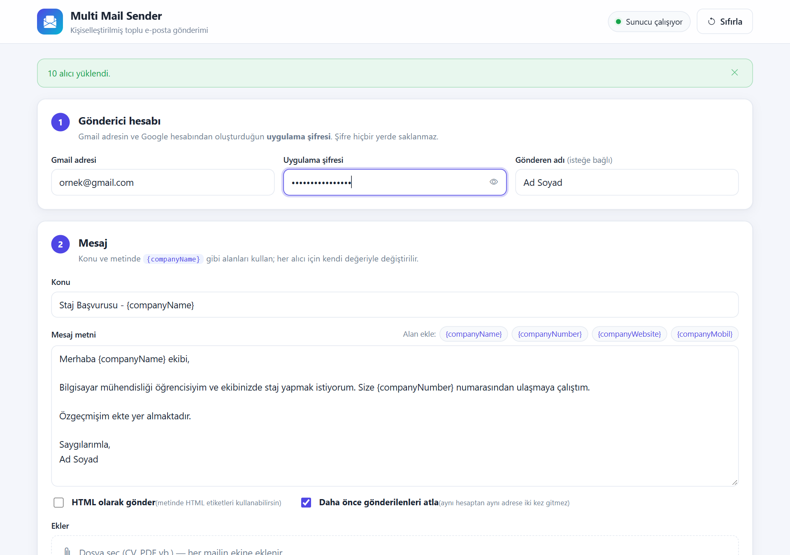

## İçindekiler

- [Hızlı kurulum (Windows)](#hızlı-kurulum-windows)
- [Özellikler ve ekran görüntüleri](#özellikler-ve-ekran-görüntüleri)
- [Gmail uygulama şifresi nasıl alınır?](#gmail-uygulama-şifresi-nasıl-alınır)
- [Elle kurulum / Docker](#elle-kurulum--docker)
- [Hazır şirket listeleri](#hazır-şirket-listeleri-internaldata)
- [API](#api)
- [Yapılandırma](#yapılandırma)
- [Geliştirme ve test](#geliştirme-ve-test)
- [Sorun giderme](#sorun-giderme)

## Hızlı kurulum (Windows)

1. Repoyu indirin (`Code → Download ZIP` ya da `git clone`).
2. **`start.bat`** dosyasına çift tıklayın.

Betik sırayla şunları yapar:

| Adım | Ne yapar |
|---|---|
| 1 | Java 17+ (JDK) arar; yoksa `winget` ile Temurin 17 kurar |
| 2 | Node.js 18+ arar; yoksa `winget` ile Node LTS kurar |
| 3 | Backend'i derler (ilk seferde Maven bağımlılıklarını indirir) |
| 4 | Frontend bağımlılıklarını (`npm install`) yükler |
| 5 | Backend (`:8080`) ve frontend'i (`:4200`) ayrı pencerelerde başlatır, hazır olunca tarayıcıda **http://localhost:4200** adresini açar |

İlk kurulum internet hızına göre birkaç dakika sürer, sonraki açılışlar birkaç saniyedir. Kapatmak için **`stop.bat`** çalıştırın (ya da "MMS Backend" / "MMS Frontend" pencerelerini kapatın).

> `winget` yoksa (eski Windows 10) betik hangi adresten ne kuracağınızı söyler.

## Özellikler ve ekran görüntüleri

### 1. Gönderici hesabı

Gmail adresiniz, uygulama şifreniz ve isteğe bağlı **gönderen adı**. Şifre sadece gönderim sırasında sunucuya iletilir, hiçbir yere kaydedilmez ve loglanmaz.

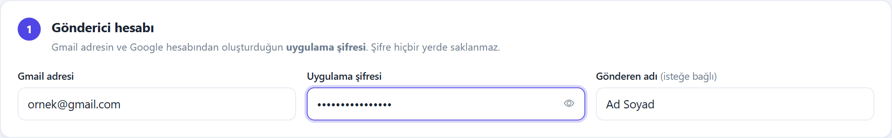

### 2. Mesaj, alan ekleme ve önizleme

- Konu ve metinde `{companyName}`, `{companyNumber}` gibi alanlar kullanılır. Üstteki **çiplere** tıklayınca imlecin olduğu yere eklenir.
- **Önizleme** bölümü seçtiğiniz alıcı için konunun ve metnin nasıl görüneceğini gösterir (alıcılar arasında gezebilirsiniz).
- **HTML olarak gönder** ile metinde HTML kullanabilirsiniz (alan değerleri güvenli şekilde kaçışlanır).
- **Daha önce gönderilenleri atla**: aynı hesaptan aynı adrese ikinci kez mail gitmez.
- Ek dosyalar (CV, PDF vb.) her maile eklenir.

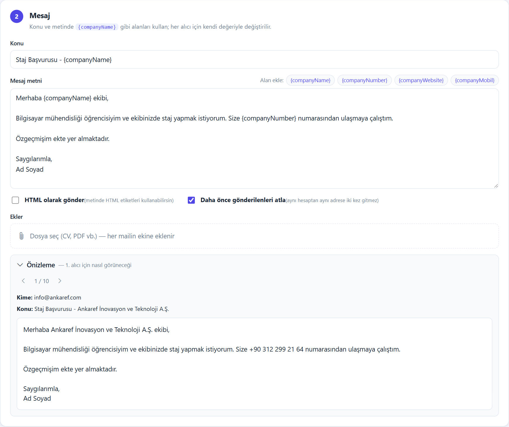

### 3. Alıcılar tablosu

Şirketleri elle ekleyebilir ya da **JSON / CSV** dosyasından içe aktarabilirsiniz (`İçe aktar`). Hücreler doğrudan düzenlenir, `Alan ekle` ile yeni sütun açılır, `JSON dışa aktar` ile listeyi kaydedersiniz.

- Mesajda kullanılan bir alan bir alıcıda **boşsa** hücre kırmızı olur ve uyarı çıkar; bu alıcılar gönderimde **atlanır** (yarım kalmış mail gitmez).
- `Tekrar edenleri sil` / `Geçersiz adresleri sil` ile liste temizlenir.
- CSV için ilk satır başlıktır: `companyMail,companyName,companyNumber`.

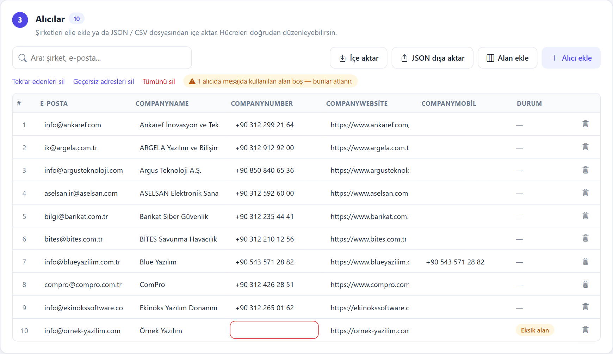

Üstteki arama kutusu şirket adı, e-posta ya da herhangi bir alanda filtreler:

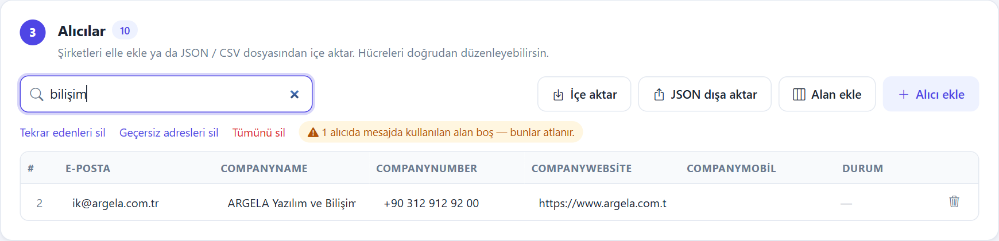

### 4. Canlı gönderim takibi

**Gönder** dedikten sonra tablodaki her satırın durumu canlı güncellenir (Gönderildi / Hata / Atlandı / Bekliyor). Sayaçlar, ilerleme çubuğu ve tahmini kalan süre görünür; **Durdur** ile işlem iptal edilir.

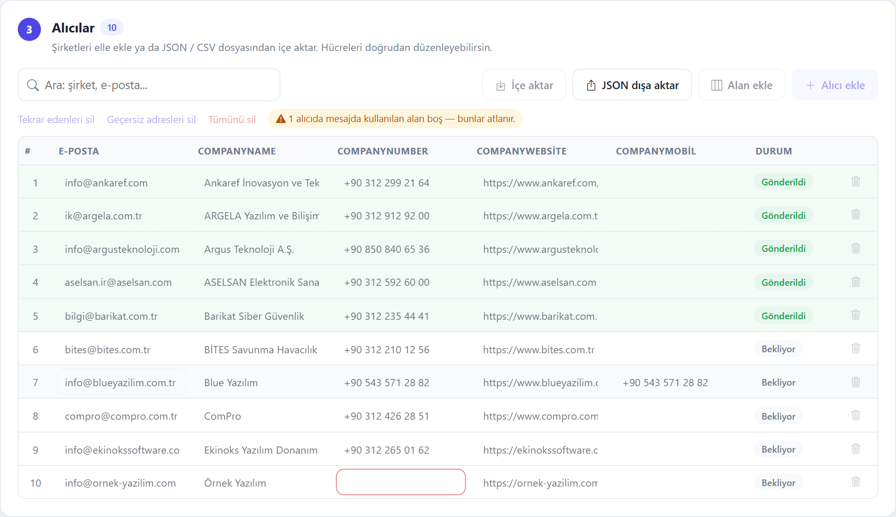
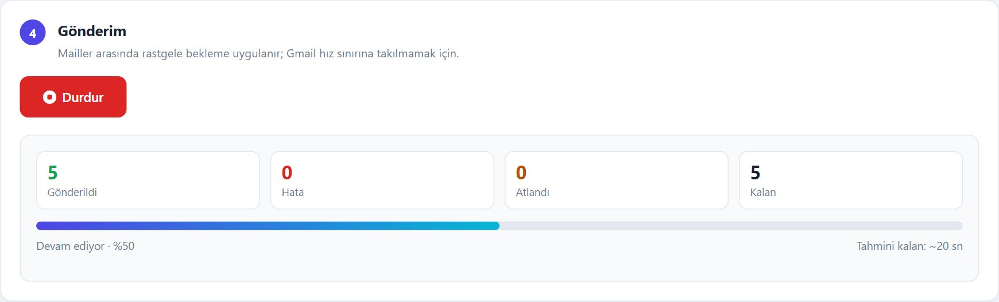

Sayfa yenilense ya da bağlantı kopsa bile gönderim sunucuda devam eder; rapor kaybolmaz.

### 5. Excel raporu

Gönderim bitince **Excel raporunu indir** butonu çıkar.

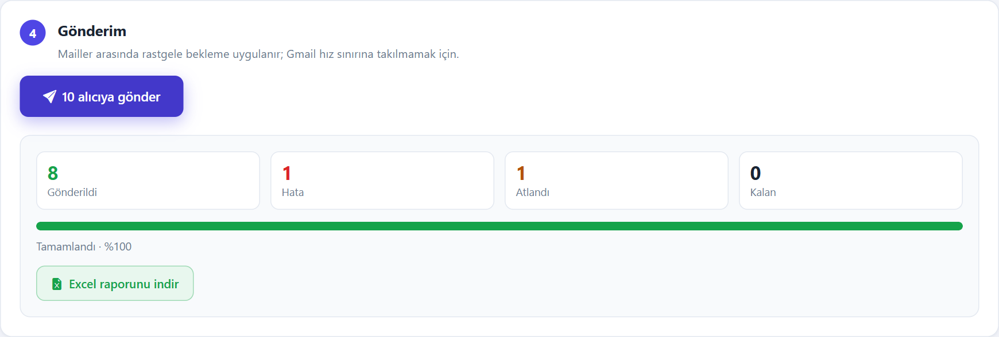

Rapor şunları içerir: şirket adı, e-posta, telefon, website, **durum** (Gönderildi / Hata / Atlandı / Beklemede), hata ya da atlama nedeni, işlem zamanı ve gönderim süresi. Durum hücreleri renklidir, ikinci sayfada özet vardır.

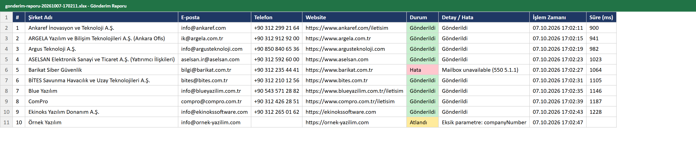

### 6. Geçmiş gönderimler

Önceki tüm gönderimler listelenir ve her birinin raporu istediğiniz zaman tekrar indirilebilir (sunucu yeniden başlasa da kaybolmaz).

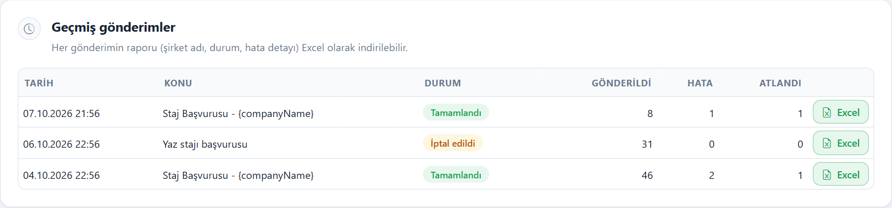

### Karanlık tema ve mobil

Tarayıcı/sistem temasına göre açık ya da koyu görünür; mobilde de kullanılabilir.

| Karanlık tema | Mobil |
|---|---|
| 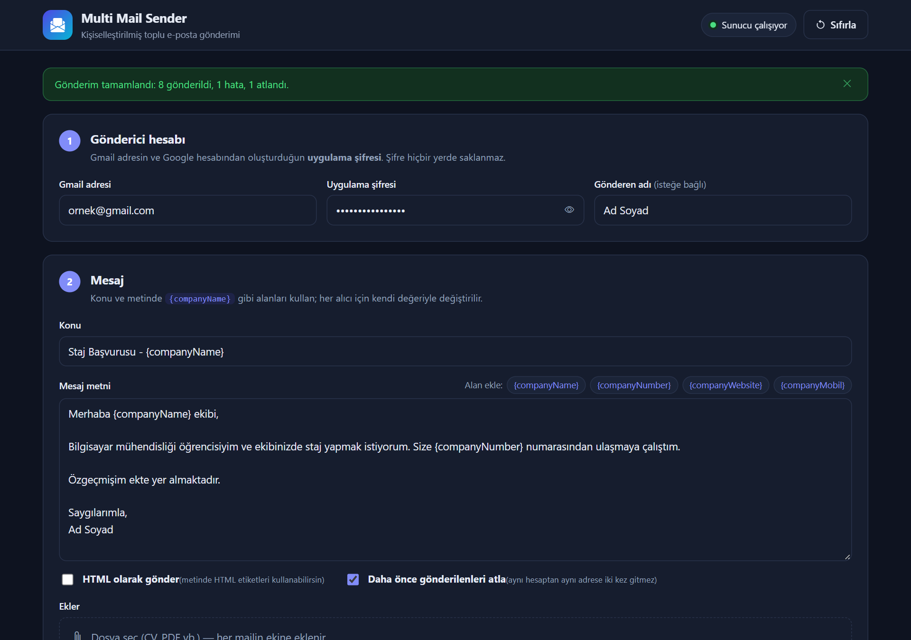 | 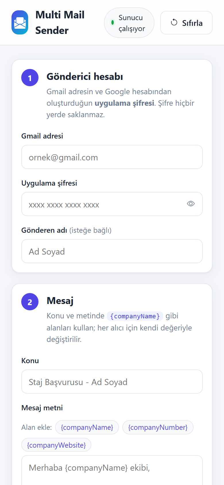 |

### Güvenlik ve güvenilirlik özeti

- Gönderim başına ayrı SMTP bağlantısı; aynı anda başka hesapla çalışan gönderimler birbirine karışmaz. Aynı hesap için ikinci gönderim reddedilir.
- Gmail şifresi yanlışsa gönderim hemen durur, her alıcı için tekrar denenmez.
- Geçici hata alan mail bir kez daha denenir; bir alıcının hatası diğerlerini durdurmaz.
- Günlük limit (varsayılan 450) Gmail'in ~500 sınırına takılmayı önler.
- Mailler arasında rastgele bekleme uygulanır (varsayılan 1–5 sn).

## Gmail uygulama şifresi nasıl alınır?

Normal Gmail şifreniz **çalışmaz**. Google hesabınızda 2 adımlı doğrulamayı açın, sonra <https://myaccount.google.com/apppasswords> adresinden bir **uygulama şifresi** (16 karakter) oluşturup arayüze yapıştırın.

## Elle kurulum / Docker

Gereksinimler: Java 17+ (JDK), Node.js 18+.

```powershell
# Backend
cd backend\MultiMailSender
.\mvnw spring-boot:run

# Frontend (ayrı terminal)
cd frontend\multi-mail-sender
npm install
npm start
```

Tarayıcıda <http://localhost:4200>. Geliştirme sunucusu `/api` isteklerini `localhost:8080`'e yönlendirir (`proxy.conf.json`).

**Docker:**

```bash
docker compose up --build   # arayüz: http://localhost:4200
```

Gönderim raporları ve gönderilenler listesi `mms-data` volume'unda saklanır.

## Hazır şirket listeleri (`internalData/`)

Şehir bazlı IT şirketi listeleri (`<il>ITCompanies.json`), şu an **27 ilde ~1150 firma**: Ankara 246, İstanbul 250, Kocaeli 145, İzmir 102, Antalya 85, Sivas 42, Gaziantep 40, Manisa 36, Erzurum 32, Kırıkkale 30, Samsun 28, Trabzon 26, Tekirdağ 20, Karabük 16, Çorum 12, Diyarbakır 9, Giresun 8, Yalova 7, Van 6, Muğla 4, Karaman 3, Çanakkale 2, Denizli 2, Bursa 1, Kütahya 1, Mersin 1, Zonguldak 2.

> **Diğer iller henüz yok.** Teknokent sitesi firma listesini vermeyen ya da bota kapalı olan illerde (Konya, Kayseri, Adana, Hatay, Eskişehir vb.) veri toplanamadı. Küçük sayılı iller (1–5 kayıt) sitenin sunduğu kadarını yansıtır. Arayüzde **İçe aktar** ile yüklenir. Her kayıtta e-posta, şirket adı, telefon, website ve **doğrulanma tarihi** (`verifiedAt`) bulunur.

Listeler `tools/refresh_data.py` ile bakım görür:

```bash
python tools/refresh_data.py                 # sadece rapor (dosyaları değiştirmez)
python tools/refresh_data.py --write         # temizle: tekrarları ve ölü domain'leri sil, biçimi düzelt
python tools/refresh_data.py --write --harvest                 # Ankara: Hacettepe, OSTİM, Bilkent Cyberpark
python tools/refresh_data.py --write --parks sivas,istanbul,antalya,kocaeli,izmir,manisa   # diğer teknokentler
python tools/refresh_data.py --write --generic "erzurum=http://www.atateknokent.com.tr"   # herhangi bir teknokent sitesini genel tarayıcıyla tara
```

Araç; e-posta adresinin MX/DNS kaydını doğrular, tekrarları siler, telefonları `+90 312 000 00 00` biçimine getirir ve firmaların kendi sitelerinden `info@` / `hr@` benzeri genel adresleri bulur (kişi adlı adresleri almaz). Son çalıştırmanın ayrıntısı `internalData/REPORT.md` dosyasındadır.

> Listeler otomatik toplanır; gönderimden önce örneklem kontrolü yapmanız önerilir. Sitesi yalnızca ada göre tahmin edilen firmalarda yanlış eşleşme olabilir.

## API

| Endpoint | Açıklama |
|---|---|
| `POST /send-mails-with-attachment/start` | `multipart/form-data` (`request` JSON + opsiyonel `files`). Arka planda gönderim başlatır, `data` alanında job id döner. |
| `GET /send-mails-with-attachment/stream/{jobId}` | SSE: `started`, `progress`, `finished`. Bağlantı koparsa yeniden bağlanınca geçmiş olaylar tekrar oynatılır. |
| `POST /jobs/{jobId}/cancel` | Çalışan gönderimi durdurur. |
| `GET /jobs`, `GET /jobs/{jobId}` | Geçmiş gönderimler ve alıcı bazlı sonuçlar. |
| `GET /jobs/{jobId}/export.xlsx` | Excel raporu. |
| `GET /health` | Sağlık kontrolü. |

`request` alanları: `username`, `password`, `fromName` (ops.), `subject`, `bodydraft`, `html` (ops.), `skipAlreadySent` (ops.), `companyData[]`. Örnek: [`exampleRequest.json`](backend/MultiMailSender/src/main/resources/exampleRequest.json).

```json
{
  "username": "ornek@gmail.com",
  "password": "uygulama-sifresi",
  "subject": "Staj Başvurusu - {companyName}",
  "bodydraft": "Merhaba {companyName} ekibi, ...",
  "companyData": [
    { "id": 0, "companyMail": "info@ornek.com", "parameters": { "companyName": "Örnek A.Ş." } }
  ]
}
```

## Yapılandırma

Ortam değişkenleri ile (varsayılanlar parantez içinde):

| Değişken | Anlamı |
|---|---|
| `MAIL_COOLDOWN_MIN_MS` / `MAIL_COOLDOWN_MAX_MS` | Mailler arası rastgele bekleme (1000 / 5000) |
| `MAIL_DAILY_LIMIT` | Hesap başına günlük başarılı mail sınırı (450, `0` = kapalı) |
| `MAIL_DATA_DIR` | Rapor ve gönderim kayıtlarının klasörü (`data`) |
| `MAIL_SMTP_HOST` / `MAIL_SMTP_PORT` | SMTP sunucusu (`smtp.gmail.com` / `587`) |
| `MAIL_CORS_ORIGINS` | İzinli arayüz adresleri (`http://localhost:4200`) |

## Geliştirme ve test

```powershell
cd backend\MultiMailSender ; .\mvnw verify        # backend testleri
cd frontend\multi-mail-sender ; npm test           # frontend testleri (Chrome gerekir)
```

GitHub Actions (`.github/workflows/ci.yml`) her push'ta ikisini de çalıştırır.

## Sorun giderme

| Belirti | Çözüm |
|---|---|
| `8080` / `4200` portu kullanımda | `stop.bat` çalıştırın veya o portu kullanan programı kapatın |
| "Sunucuya ulaşılamıyor" | "MMS Backend" penceresindeki hata mesajına bakın; Java 17+ gerekir |
| Gmail kimlik doğrulaması başarısız | Normal şifre değil **uygulama şifresi** kullanın, 2 adımlı doğrulama açık olmalı |
| Alıcı "Atlandı – Eksik parametre" | Mesajda kullanılan alan o şirkette boş; tabloda kırmızı hücreyi doldurun ya da alanı mesajdan çıkarın |
| Mailler spam'e düşüyor | Gönderen adı ekleyin, az sayıda ve kişiselleştirilmiş gönderin, bekleme süresini artırın |

## Katkıda bulunma

1. Repo'yu fork'layın, yeni bir branch açın.
2. Değişikliklerinizi test edin (`mvnw verify`, `npm test`).
3. PR gönderin.

## Lisans

[MIT](LICENSE)
