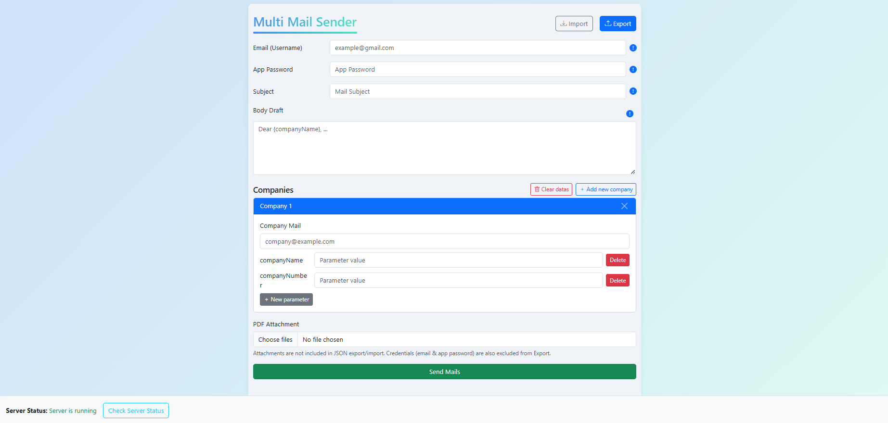

# MultiMailSender

MultiMailSender is an open-source bulk email sending application with a modern Angular-based frontend and a robust Spring Boot backend. It allows you to send personalized emails to multiple recipients, each with custom parameters and optional attachments.

## Features

- Bulk email sending with per-recipient personalization
- Supports PDF and other file attachments
- Secure authentication using Gmail App Password
- User-friendly, modern, and well-documented interface
- Server health check endpoint
- Easy deployment with Docker support

## Technologies Used

- **Backend:** Java 17, Spring Boot 3, Spring Mail, Maven, Lombok
# MultiMailSender

MultiMailSender, Angular tabanlı modern bir ön yüz ve Spring Boot tabanlı sağlam bir arka yüz ile çoklu kişilere kişiselleştirilmiş e-posta göndermenizi sağlayan bir açık kaynak uygulamadır. Her alıcı için farklı parametreler kullanabilir, ek dosyalar (PDF vb.) gönderebilir ve gönderim ilerlemesini gerçek zamanlı olarak takip edebilirsiniz.



## Özellikler

- Kitle (bulk) e-posta gönderimi
- Her alıcıya özel kişiselleştirilmiş şablon alanları (ör. {companyName})
- Dosya ekleri desteği (PDF, dokümanlar)
- Gmail App Password ile güvenli SMTP gönderimi
- Gönderim ilerleme bildirimleri ve durum takibi
- Docker ile kolay dağıtım opsiyonu

## Teknolojiler

- Backend: Java 17, Spring Boot, Spring Mail, Maven
- Frontend: Angular, Bootstrap, RxJS
- Diğer: Docker (opsiyonel)

## Hızlı Başlangıç (Windows)

Öncelikle repoyu klonlayın ve proje dizinine gidin:

1) Backend (Spring Boot)

- Gereksinimler: Java 17+ ve Maven
- Proje dizinine gidin ve çalıştırın:

```powershell
cd backend\MultiMailSender
.\mvnw clean install
.\mvnw spring-boot:run
```

Alternatif olarak sisteminizde Maven varsa:

```powershell
mvn clean install
mvn spring-boot:run
```

2) Frontend (Angular)

- Gereksinimler: Node.js (18+), npm
- Frontend dizinine gidin ve bağımlılıkları kurup çalıştırın:

```powershell
cd frontend\multi-mail-sender
npm install
npm start   # /api isteklerini localhost:8080'e yönlendirir (proxy.conf.json)
```

Ardından tarayıcıda `http://localhost:4200` adresini açın.

## API Kullanımı

| Endpoint | Açıklama |
|---|---|
| `POST /send-mails-with-attachment/start` | `multipart/form-data` (`request` JSON + opsiyonel `files`). Arka planda gönderim başlatır, `data` alanında job id döner. |
| `GET /send-mails-with-attachment/stream/{jobId}` | SSE: `started`, `progress`, `finished` olayları. Bağlantı koparsa yeniden bağlanınca geçmiş olaylar tekrar oynatılır. |
| `POST /jobs/{jobId}/cancel` | Çalışan gönderimi durdurur. |
| `GET /jobs`, `GET /jobs/{jobId}` | Geçmiş gönderimler ve alıcı bazlı sonuçlar. |
| `GET /jobs/{jobId}/export.xlsx` | Excel raporu: şirket adı, e-posta, telefon, website, durum, hata detayı, zaman. |
| `GET /health` | Sağlık kontrolü. |

`request` alanları: `username`, `password`, `fromName` (ops.), `subject`, `bodydraft`, `html` (ops.), `skipAlreadySent` (ops.), `companyData[]`
(örnek: `backend/MultiMailSender/src/main/resources/exampleRequest.json`). Şablonda kullanılan `{alan}` bir alıcıda boşsa o alıcı **atlanır**.

Gönderim raporları ve gönderilenler listesi `MAIL_DATA_DIR` (varsayılan `data/`) altında saklanır. Günlük limit `MAIL_DAILY_LIMIT` (varsayılan 450) ile ayarlanır.

## Docker

```bash
docker compose up --build   # arayüz: http://localhost:4200
```

## Veri (`internalData/`)

Şehir bazlı şirket listeleri. Bakım için: `python tools/refresh_data.py` (rapor) veya `--write` (uygula; `--harvest` ile Hacettepe Teknokent'ten yeni Ankara firmaları ekler). Ayrıntı: `internalData/REPORT.md`.

## Konfigürasyon

- GUI içerisinde verilen username ve password(app password) bilgilerinizi girin. Başka ekstra bir konfigürasyona ihtiyaç duyulmamaktadır. 

## Katkıda Bulunma

1. Repo'yu fork'layın
2. Yeni bir branch açın
3. Değişikliklerinizi test edin ve PR gönderin
